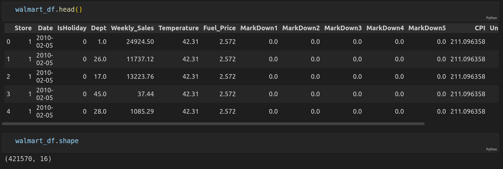
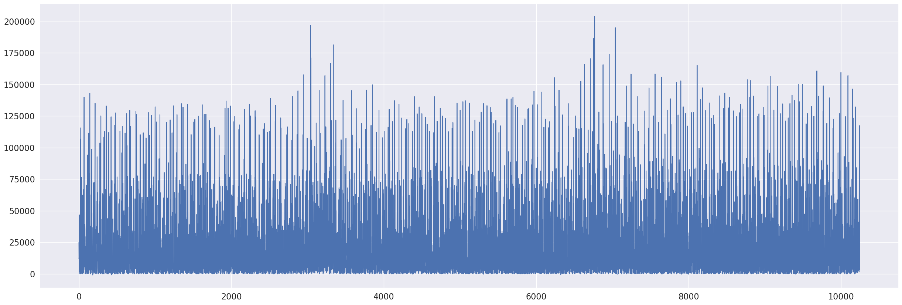
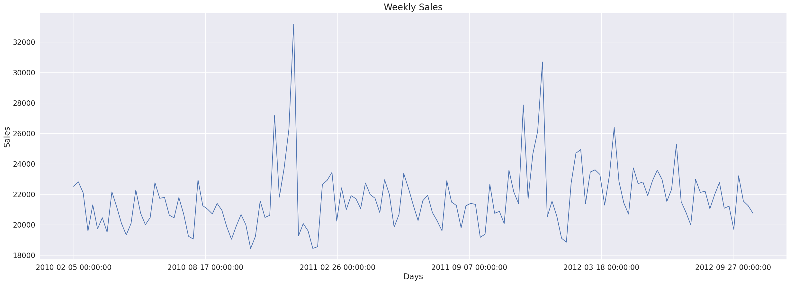
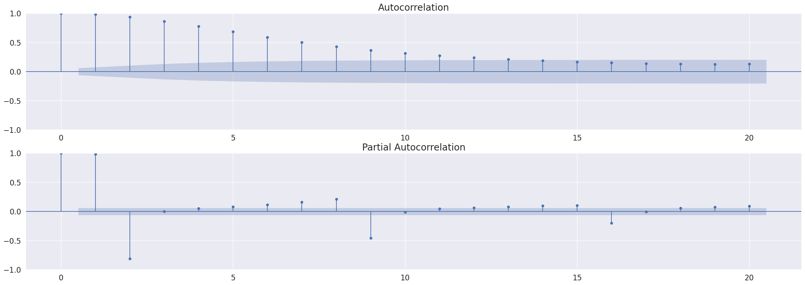
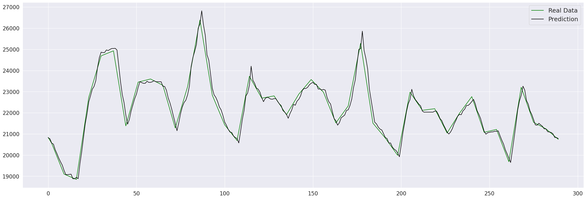
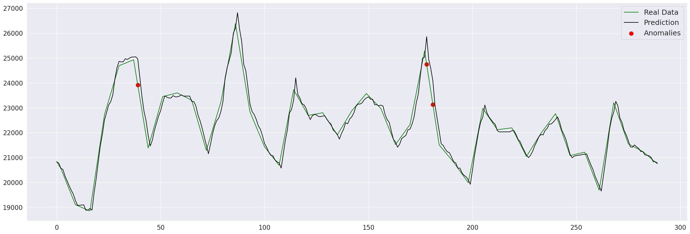

# xgboost_tsfresh_anomaly_detection
Anomaly detection using XGBoost and tsfresh.

# Dataset

This dataset contains sales data in Walmart stores. Data has 421570 rows and 16 columns.



In this project we will use only Weekly Sales for Store 1.



# Resample Data

We will resample data by day and take the mean values. Below is a plot of resampled dataset.



# Autocorrelation and Partial Autocorrelation

Plot autocorrelation and partial autocorrelation.



# Train/Test Data Split

We will split our data by years. Years 2010 and 2011 will be train data, year 2012 will be test data.

```
walmart_store_one_train = walmart_store_one.loc[((walmart_store_one['Year'] == 2010) | (walmart_store_one['Year'] == 2011))]
walmart_store_one_train = walmart_store_one_train.drop(['Year'], axis=1)

walmart_store_one_test = walmart_store_one.loc[(walmart_store_one['Year'] == 2012)]
walmart_store_one_test = walmart_store_one_test.drop(['Year'], axis=1)
```

# TSFresh Feature Extraction

We will try to predict one value using ten previous values. To split our data we will use split_sequences function.

```
def split_sequnces(sequences, n_steps):
    X, y = list(), list()
    for i in range(len(sequences)):
      end_ix = i + n_steps
      if end_ix > len(sequences)-1:
        break
      seq_x, seq_y = sequences[i:end_ix], sequences[end_ix]
      X.append(seq_x)
      y.append(seq_y)
    return np.array(X), np.array(y)
```

Next lets create dataframes for train and test data.

```
X_train_splitted, y_train = split_sequnces(walmart_store_one_train['Weekly_Sales'], n_steps)

X_train_df = pd.DataFrame(X_train_splitted, columns=columns)
X_train_df['id'] = [i for i in range(685)]
X_train_df['date'] = walmart_store_one_train['Date'][n_steps:].values
```

```
X_test_splitted, y_test = split_sequnces(walmart_store_one_test['Weekly_Sales'].reset_index(drop=True), n_steps)

X_test_df = pd.DataFrame(X_test_splitted, columns=columns)
X_test_df['id'] = [i for i in range(290)]
X_test_df['date'] = walmart_store_one_test['Date'][n_steps:].values
```

Now we can extract features using tsfresh.

```
extraction_settings = MinimalFCParameters()
X_train = extract_features(X_train_df, column_id='id', column_sort='date', default_fc_parameters=extraction_settings)
```

```
extraction_settings = MinimalFCParameters()
X_test = extract_features(X_test_df, column_id='id', column_sort='date', default_fc_parameters=extraction_settings)
```

# XGBRegressor Train

Now we can try to fit our data to XGBRegressor.

```
from xgboost import XGBRegressor

reg = XGBRegressor(base_score=0.5, booster='gbtree',    
                           n_estimators=1000,
                           objective='reg:squarederror',
                           max_depth=3,
                           learning_rate=0.01)
reg.fit(X_train,y_train)
```

Lets make a prediction and plot it.



# Anomaly Detection

If residual is above the threshold we will mark it as anomaly.

```
residuals = pd.DataFrame(y_true - y_pred, columns=['error'])
UCL = residuals.abs().sum(axis=1).quantile(0.99)
```

Lets plot detected anomaly in our data.


